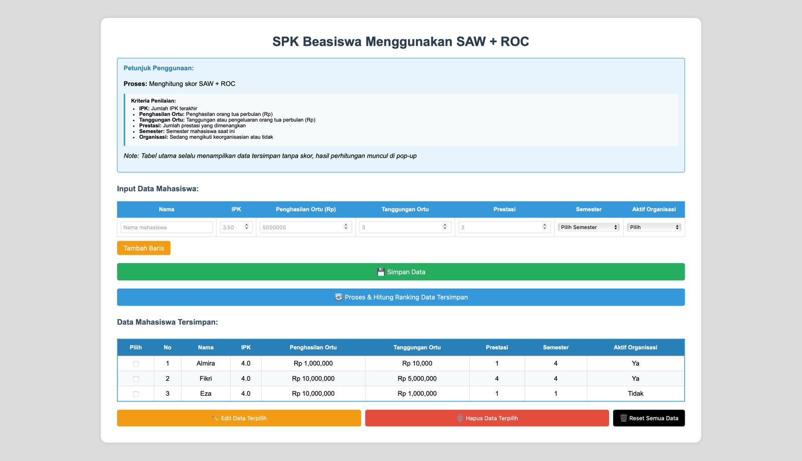

# SAW ROC Flask

Aplikasi Sistem Pendukung Keputusan menggunakan metode **SAW (Simple Additive Weighting)** dengan pendekatan **ROC (Rank Order Centroid)**. Dibangun menggunakan framework **Flask (Python)** dan database SQLite.

## 🔍 Fitur

- CRUD Kriteria dan Alternatif
- Bobot otomatis menggunakan metode ROC
- Perhitungan keputusan menggunakan metode SAW
- Tampilan antarmuka berbasis HTML/CSS dengan Bootstrap
- Tabel hasil keputusan yang tersorting
- Penyimpanan hasil ke dalam database

## 🖼️ Preview Tampilan

### Dashboard


### Form Edit


### Pesan Popup


### Hasil Perhitungan


## 🚀 Cara Menjalankan Aplikasi

### 1. Clone repositori

```bash
git clone https://github.com/username/saw-roc-flask.git
cd saw-roc-flask
```

### 2. Buat Virtual Environment (opsional namun disarankan)

```bash
python -m venv venv
source venv/bin/activate  # Untuk Linux/Mac
venv\Scripts\activate     # Untuk Windows
```

### 3. Install dependensi

```bash
pip install -r requirements.txt
```

> Jika `requirements.txt` belum tersedia, kamu bisa membuatnya dengan:
>
> ```bash
> pip freeze > requirements.txt
> ```

### 4. Jalankan aplikasi Flask

```bash
python app.py
```

### 5. Akses di browser

Buka `http://127.0.0.1:5000/` di browser untuk melihat aplikasi berjalan.

## 🧱 Struktur Folder

```
.
├── app.py
├── templates/
│   ├── index.html
│   ├── kriteria.html
│   └── hasil.html
├── static/
│   └── style.css
├── database.db
└── README.md
```

## 📌 Catatan

- Pastikan kamu menggunakan Python 3.8 ke atas.
- Database SQLite akan dibuat secara otomatis saat aplikasi pertama kali dijalankan.

## 📄 Lisensi

Proyek ini bebas digunakan untuk pembelajaran dan pengembangan lebih lanjut. Tambahkan lisensi (MIT, GPL, dll.) jika diperlukan.
